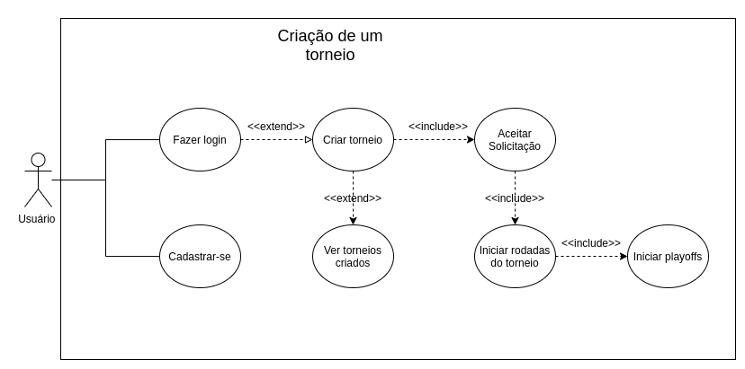

# Documento de Arquitetura de Software (DAS)

# Sistema de Gestão de Estágios

# Introdução

## Proposta

Este documento apresenta uma visão geral da arquitetura do sistema, utilizando diferentes visões arquiteturais para destacar diferentes aspectos do sistema. É utilizado para capturar as decisões arquiteturais significativas que fizeram parte do sistema.

## Escopo

A aplicação "Sistema de Gestão de Estágios" tem o objetivo de gerenciar alunos, empresas, orientadores, documentos, termos de compromisso e relatórios relacionados ao acompanhamento de estágios.

## Definições, Acrônimos e Abreviações

- MVC - Model View Controller.
- MVT - Model View Template.
- SGE - Sistema de Gestão de Estágios.

## Visão Geral

O Documento de Arquitetura de Software (DAS) trata-se de uma visão geral de toda a arquitetura do sistema, observando diferentes aspectos do mesmo. Neste documento serão abordadas as seguintes visões da aplicação SGE:

- Caso de Uso;
- Lógica;
- Implantação;
- Implementação;
- Dados;

# Representação Arquitetural

## Cliente-Servidor

Cliente-Servidor é um modelo de arquitetura...

Cliente (Frontend):

- View: Consiste.....

Servidor (Backend):

- Controller: faz a conexão entre as camadas...
- Service: Responsável pela lógica...
- Model: Responsável pela persistência...

# Objetivos de Arquitetura e Restrições

## Objetivos

Segurança:
   -
Persistência:
   - 
Privacidade:
   - Middlewares: Foi usado middlewares...
Desempenho:
   Requisições...
Reusabilidade:
   Componentes no Frontend...

## Restrições

Tamanho da tela:...

Portabilidade:...

| IE | Edge  | Firefox | Chrome | Safari | Googlebot |
| -- | ----- | ------- | ------ | ------ | --------- |
| 11 | >= 14 | >= 52   | >= 49  | >= 10  | Sim       |

Serviços: Os serviços oferecidos....

Acesso a internet: A aplicação está limitada apenas a conexão com internet

## Ferramentas Utilizadas

- Python: Linguagem de programação utilizada no backend.
- Django: Framework principal da aplicação.
- Django REST Framework: Desenvolvimento da API REST.
- SQLite: Banco de dados utilizado no projeto.
- Git: Controle de versão.
- GitHub: Hospedagem do código-fonte.
- MkDocs: Geração da documentação.
- VS Code: Ambiente de desenvolvimento.

# Visão de Caso de Uso

Os casos de uso representam as principais funcionalidades do sistema relacionadas ao gerenciamento de estágios, usuários, documentos e relatórios.

# Visão Lógica

# Visão de Implantação

# Visão de Implementação

## Visão Geral

# Visão de Dados

## Modelo Entidade Relacionamento (MER)

#### Entidades e Relacionamentos:

## Diagrama Entidade Relacionamento (DER)

# Tamanho e Desempenho

# Qualidade

# Referências Bibliográficas

# Histórico de Versão

| Data       | Versão | Descrição                                                            | Autor(es)                                   |
| ---------- | ------- | ---------------------------------------------------------------------- | ------------------------------------------- |
| 08/11/2020 | 1.0 | Criada estrutura básica do documento | Equipe do Projeto |
| 15/11/2020 | 1.1     | Representação arquitetural e objetivos e restrições arquiteturais. | Autores                                     |
| 19/11/2020 | 1.2     | Adição dos diagramas, visões, tamanho e desempenho e qualidade      | Autores                                     |
| 20/11/2020 | 1.3     | Adição da descrição de MER e DER                                   | Autores                                     |
| 20/11/2020 | 1.4     | Adição do tópico de qualidade                                       | Autores                                     |
| 20/11/2020 | 1.5     | Revisão                                                               | Autores                                     |